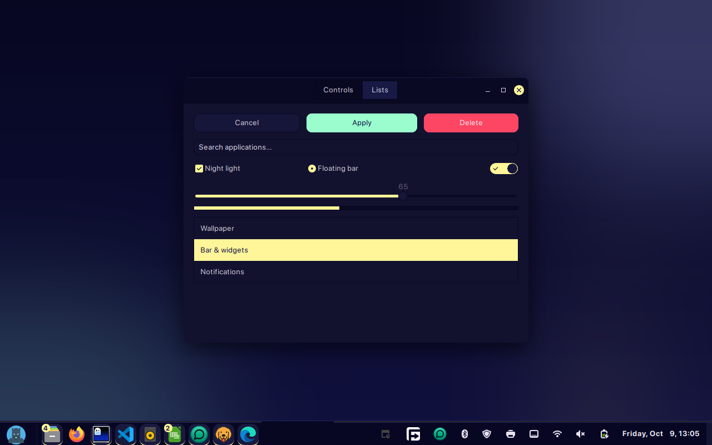

# Nocturne

A deep-navy dark theme for Cinnamon, inspired by the colour palette and rounded,
pill-shaped look of the [Noctalia](https://noctalia.dev) Wayland shell.

## Features

- Navy surfaces with a soft yellow accent, lavender links and mint hover states
- Rounded, pill-style panel applets and window-list buttons, with a yellow
  underline on running apps
- Rounded menus, notifications, tooltips, OSDs and Alt-Tab switcher
- Matching GTK 2, GTK 3, GTK 4 / libadwaita and window border (metacity) themes
- Dark text on every yellow or mint surface for readable contrast
- Works with the panel on any side of the screen

## Palette

| Role | Colour |
| --- | --- |
| Surface | `#070722` |
| Surface variant | `#11112d` |
| Outline | `#21215f` |
| Accent (primary) | `#fff59b` |
| Secondary | `#a9aefe` |
| Hover (tertiary) | `#9bfece` |
| Text | `#f3edf7` |
| Text on accent | `#0e0e43` |

## Applying

After installing, open **System Settings → Themes** and choose **Nocturne** for
Desktop, Applications and Window borders. Papirus-Dark icons pair well with it.

## Credits

- Based on **Mint-Y** by Linux Mint (GPL-3.0-or-later).
- Colour palette from **Noctalia** by the noctalia-dev team (MIT). Nocturne is an
  independent Cinnamon theme and is not affiliated with the Noctalia project.

## License

GPL-3.0-or-later. See `files/Nocturne/COPYING`.
