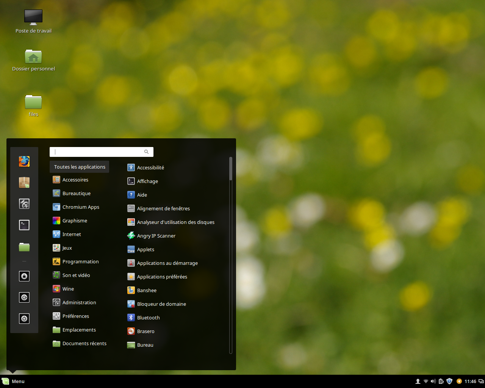

#  The Sentinel
A dark, flat and lightweight theme for the cinnamon desktop environment based on the *Linux Mint* theme.

## Screenshot

## Installation
- Clone or copy this repository in your `~/.themes` directory
- In the *Themes* panel of your *system settings*, click *add/remove themes*
- Enable *The Sentinel* theme