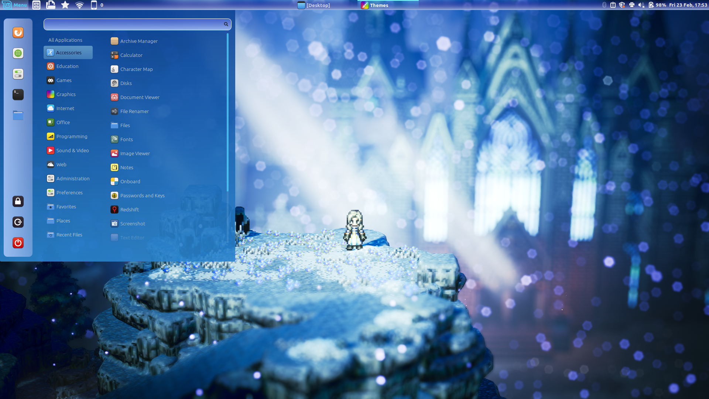

# Winterbloom

A frosty, transparent theme for Cinnamon.

## Featuring:

- Blue and white-ish tones
- Gradient fills
- Transparency
- Minor variations on the window list
- An overall frosty and chilly vibe

## How to install

Download or clone this repo, then put the `Winterbloom` folder into your `~/.themes` folder.

## Theme variants

This theme comes in four variants:

* A: All panels at the edges of the screen are "bright on the inside", as shown in the screenshot. Recommended if your panels are set to "always show".
* B: All panels have their background gradient inverted with respect to the screenshot (i.e. "transparent on the inside"). Recommended if your panels are set to "automatically hide".
* X: Top and bottom panels are "bright on the inside", left and right "transparent on the inside". *(Default variant)*
* Y: The opposite of X.

To change variant: 
1. Open the `panel-common.scss` file
2. Change the `@import 'panel-X';` instruction to select the variant of your choice
3. Compile the theme: `sass cinnamon/sass/main.scss cinnamon/cinnamon.css` *(You need to have [Sass](https://sass-lang.com/) installed)*
4. Restart Cinnamon, or change your theme back and forth

## Notes

Inspired by the [Waterbody](https://cinnamon-spices.linuxmint.com/themes/view/waterbody) theme.

Wallpaper is from the game *Octopath Traveler*.

### Compatibility

The only thing that is known for sure at the moment is that this theme is compatible with Cinnamon 5.0.7.

Since Winterbloom's CSS is heavily based on Waterbody's, the former should reasonably work with all versions compatible with the latter.
