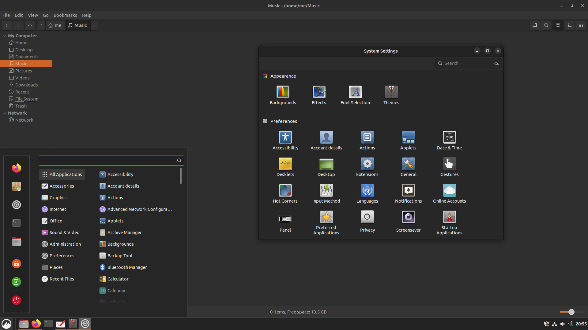

# Yaru-cinnamon-dark

Ubuntu Cinnamon dark theme available at https://github.com/ubuntucinnamon/ubuntucinnamon-environment

## How to install

Download or clone this repo, then put the `Yaru-cinnamon-dark/files/Yaru-cinnamon-dark` folder into your `~/.themes` folder.

Change all your fonts size in the Fonts app to 11 to match Ubuntu. Mint is set to 10 by default.
