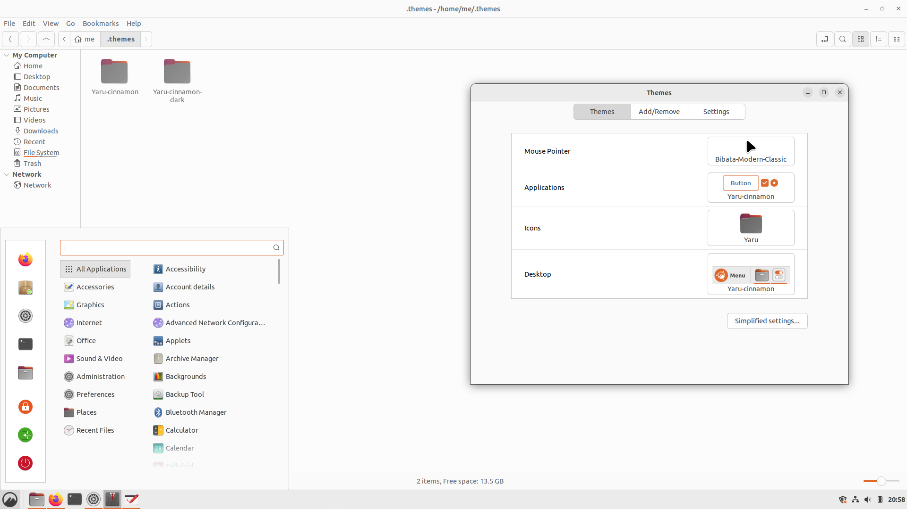

# Yaru-cinnamon

Ubuntu Cinnamon light theme available at https://github.com/ubuntucinnamon/ubuntucinnamon-environment

## How to install

Download or clone this repo, then put the `Yaru-cinnamon/files/Yaru-cinnamon` folder into your `~/.themes` folder.
