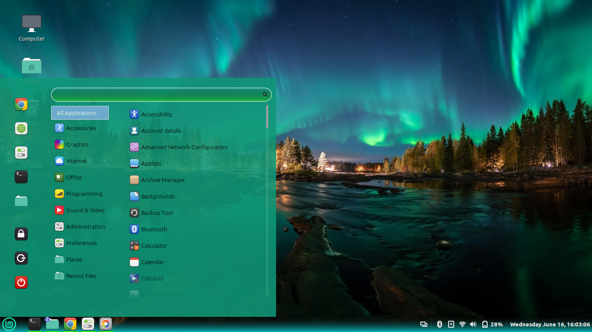

# [waterbody-cinnamon-theme][repo]
> Just a theme build for Cinnamon-spice

## Installation
### Cinnamon Settings (recommended)
Go to `Settings > Themes` and search for "waterbody".

#### From source
Clone [this repository][repo] and run `make install` or `make install-dark`.

#### Cinnamon Spices
Go [here][spices] and download the theme. Then extract the content into your `~/.theme` folder.

---
## Developing
Run `./utils.sh watch` to automatically compile and reload the theme. It will create a link in `~/.themes`.

_It's important to run utils.sh from its containing directory._

**IMPORTANT**: Never edit CSS files directly. They are overriden at build.

[repo]: https://github.com/tirtharajsinha/waterbody-cinnamon-theme
[spices]: https://cinnamon-spices.linuxmint.com/themes/view/waterbody

